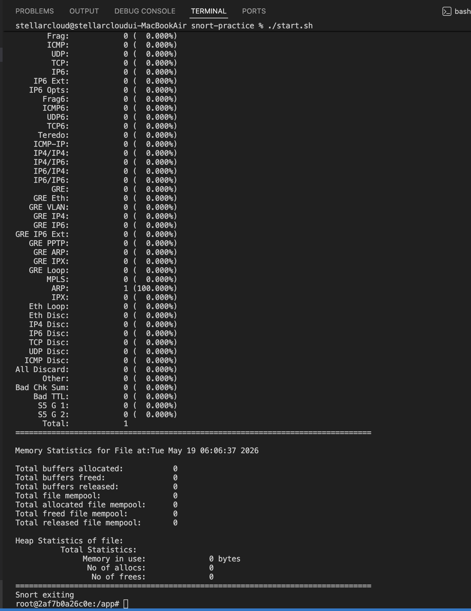
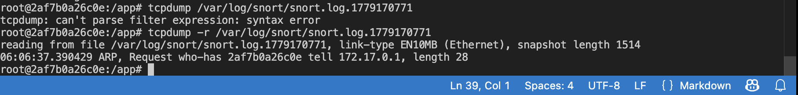
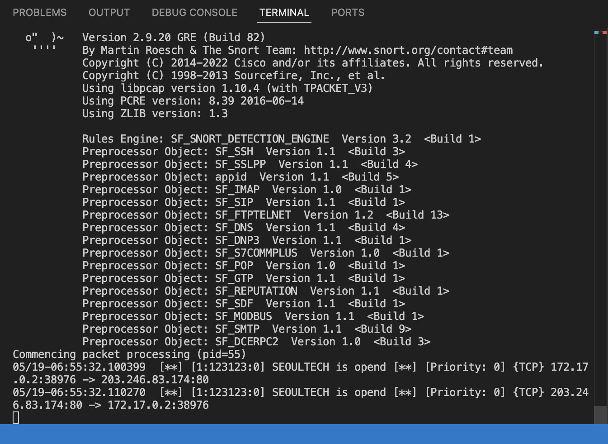
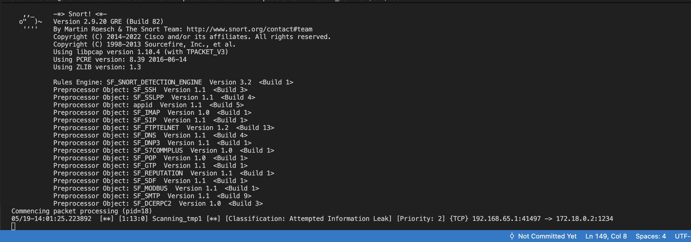
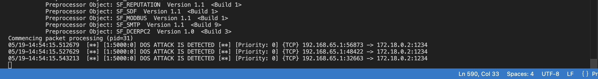

# snort-practice

4th year ITM Information Security Assignment

I put explanations after code block to address previous assignment's feedback.

- **Client**: 20102105 Kim Seungjun
- **Server**: 22101997 Park Seonghun

To follow this project, please clone this project and read `README.md`

# Table of Contents

- [0th Snort Logging with Using NMAP](#snort-logging-with-using-nmap)
    - [Loading Container](#loading-container)
    - [Running Snort](#running-snort)
    - [Send curl request](#send-curl-request)
    - [Capturing Result](#capturing-result)
    - [Checking Log File](#checking-log-file)
- [1st Creating Custom Rules](#creating-custom-rules)
    - [Creating Rules File](#creating-rules-file)
    - [Modifying `snort.conf`](#modifying-snortconf)
    - [Running Snort with `snort.conf`](#running-snort-with-snortconf)
        - [Docker Checksum Problem](#docker-checksum-problem)
    - [Execute Instruction by Another Terminal](#execute-instruction-by-another-terminal)
- [2nd Creating Other Local Rules](#creating-other-local-rules)
    - [Creating `local.rules`](#creating-localrules)
    - [Modifying `snort.conf`](#modifying-snortconf-1)
    - [Running Snort](#running-snort-1)
    - [Open Port](#open-port)
    - [Scanning Port using NMAP](#scanning-port-using-nmap)
- [3rd Creating DoS Rules](#creating-dos-rules)
    - [Creating `dos.rules`](#creating-dosrules)
    - [Modifying `snort.conf`](#modifying-snortconf-2)
    - [Running Snort](#running-snort-2)
    - [Send TCP Packet all at once](#send-tcp-packet-all-at-once)
    - [Results](#results)
- [Helpful Instructions](#helpful-instructions)

## Snort Logging with Using NMAP

### Loading Container

```bash
# chmod u+x ./start.sh
./start.sh
```

> `chmod u+x` grants execute permission on `start.sh` for the file owner. `./start.sh` then runs the script, which starts the Docker container for this lab environment.

### Running Snort

```bash
# Capturing 1 packet that is Raw Packet(Binary) and Exited
snort -b -n 1
```

> `-b` tells Snort to write captured packets in raw binary (tcpdump-compatible) format to a log file.  
`-n 1` limits the session to exactly one packet before Snort exits automatically.

### Send curl request

```bash
# Just for checking the installation Snort
curl localhost:1234
```

### Capturing Result



1. The host sends a request to `localhost:1234`. (Assuming port forwarding is configured)
2. The host's network stack forwards this packet to Docker's virtual network bridge interface (e.g., `docker0`).
3. The Docker engine first broadcasts an ARP (Address Resolution Protocol) request over the bridge network to find the destination container's IP.
4. Snort inside the container collects this ARP packet (1 packet).
5. However, the TCP packets that should have followed are not caught by Snort at all, and the process terminates with Total: 1 (ARP).

### Checking Log File

```bash
tcpdump -r /var/log/snort/snort.log.(number)
```

> `-r` tells `tcpdump` to read from a saved binary log file rather than a live network interface.  
Replace `(number)` with the actual Unix timestamp suffix appended to your log file (e.g., `snort.log.1779170771`).



* `reading from file /var/log/snort/...`: This means Snort is analyzing a previously saved log file (`snort.log.1779170771`) rather than a real-time network card, and the numbers at the end represent the Unix timestamp when the file was created.
* `link-type EN10MB (Ethernet)`: This indicates that the Layer 2 (Data Link Layer) type of the network where this packet was captured is the Ethernet (Standard Ethernet) specification. Although EN10MB historically refers to the 10Mbps Ethernet era, it is still displayed for any Ethernet packet in modern 100Mbps or 1Gbps environments.
* `snapshot length 1514`: This means the packet capture configuration was set to truncate and save packets up to a maximum size of 1514 bytes. Since the standard Ethernet Maximum Transmission Unit (MTU) is 1500 bytes (+ 14 bytes for the Ethernet header), it indicates that the entire packet was captured fully without any data loss.
* `06:06:37.390429`: Timestamp
* `ARP`: The Layer 3 protocol of the packet is ARP for address resolution, which is used when the IP address is known but the physical address (MAC address) of the device using that IP is unknown.
* `Request`: A "Request" packet that sends a query to the destination.
* `who-has`: A request asking "Who has this?".
* `2af7b0a26c0e`: Originally, the target IP address of the query should be in this position. However, the specific string `2af7b0a26c0e` is written instead. This represents the hexadecimal string assigned as a Docker container ID.
* `tell 172.17.0.1`: This corresponds to the virtual gateway address inside the Docker engine (Docker Bridge Interface) and is the IP address of the entity that sent this query.
* `length 28`: This means the pure size of the ARP request data itself is 28 bytes.

## Creating Custom Rules

### Creating Rules File

```bash
# ./snort_rules/snort.rules
alert tcp any any -> any any (content:"www.seoultech.ac.kr"; msg:"SEOULTECH is opend"; sid:123123;)
```

> This is a Snort rule written into `./snort_rules/snort.rules`.  
It alerts on any TCP packet whose payload contains the string `www.seoultech.ac.kr`.  
`msg` sets the alert label shown in the console, and `sid` is a unique rule ID required by Snort.

### Modifying `snort.conf`

```bash
# In Section #7, add next line
include $RULE_PATH/snort.rules
```

> Adding this line in Section 7 of `snort.conf` tells Snort to load the custom rules file at startup.  
`$RULE_PATH` is a variable already defined earlier in `snort.conf` that points to the rules directory.

### Running Snort with `snort.conf`

```bash
# Using Alert Mode Console
# So, it is not saved
snort -c /etc/snort/snort.conf -A console -i eth0
```

> `-c` loads the specified configuration file.  
`-A console` prints alerts directly to the terminal in real time instead of writing them to a file.  
`-i eth0` specifies the network interface to listen on.

#### Docker Checksum Problem

In Docker, for performance optimization, the Linux kernel leaves the packet error verification checksum blank without calculating it, **sending out packets with incorrect values** and effectively leaving the responsibility to the final physical network card.

However, **IDS engines** like Snort, upon receiving such packets with incorrect checksums, determine them to be lost or tampered forged packets; they do not even enter the rule checking (payload matching) stage and simply drop (ignore) them.

***In other words, the packet passes through eth0, but Snort filters it out from behind an internal veil (checksum).***

Therefore, checksum checking should be disabled in a Docker environment.

```bash
# TCP Checksum Offloading issue unique to Docker virtual network environments
snort -c /etc/snort/snort.conf -A console -i eth0 -k none
```

> `-k none` disables all checksum validation in Snort. This is necessary inside Docker because the kernel offloads checksum calculation to the physical NIC,  
leaving packets with invalid checksums that Snort would otherwise silently drop before any rule matching occurs.

or also, you can resolve this problem in Linux kernel level

```bash
# ethtool install
apt-get install -y ethtool

# Turn off the TX Check Sum Offload of eth0 interface
ethtool -K eth0 tx off
```

> `apt-get install -y ethtool` installs the `ethtool` utility. `ethtool -K eth0 tx off` disables TX (transmit) checksum offloading on the `eth0` interface at the kernel level, so packets are sent with correctly computed checksums that Snort can validate normally.

### Execute Instruction by Another Terminal

```bash
curl -v http://www.seoultech.ac.kr
```

> `-v` enables verbose output, showing the full HTTP request and response headers. This request generates TCP traffic containing `www.seoultech.ac.kr` in the payload, which triggers the custom Snort rule defined earlier.



## Creating Other Local Rules

### Creating `local.rules`

```bash
# You need to replace server_ip your own server ip
# Plz check the `ifconfig` or `ipconfig`
alert tcp any any -> $(SERVER_IP) 1234 (msg:"Scanning_tmp1"; flow:stateless; classtype:attempted-recon; sid:13;)
```

> This rule alerts on any TCP packet destined for port `1234` on the server host. Replace `$(SERVER_IP)` with the actual IP address of the target machine (find it with `ifconfig` or `ipconfig`). `flow:stateless` matches regardless of connection state, making it suitable for detecting SYN scans. `classtype:attempted-recon` categorizes the alert as a reconnaissance attempt.

### Modifying `snort.conf`

```bash
# include $RULE_PATH/snort.rules
include $RULE_PATH/local.rules
```

> The previous `snort.rules` line is commented out and replaced with `local.rules`. This switches the active rule set so Snort loads only the local scanning-detection rule for this exercise.

### Running Snort

```bash
# For WSL
snort -c /etc/snort/snort.conf -A console -i eth0

# For Docker Container on Host
snort -c /etc/snort/snort.conf -A console -i eth0 -k none
```

> Use the WSL command if running Snort directly inside WSL (checksums are valid). Use the Docker command (with `-k none`) if running inside a Docker container, where checksum offloading causes Snort to silently drop packets otherwise.

### Open Port

```bash
# For Docker, this line is not necessary
nc -l -p 1234
```

> `nc -l -p 1234` starts a simple TCP listener on port `1234` using Netcat, giving the scanner a reachable port to probe. In a Docker environment this step is unnecessary because the port is already exposed by the container configuration.

### Scanning Port using NMAP

```bash
# WSL
nmap -sS -p 1234 $(SERVER_IP)

# Docker Container
nmap -sT -p 1234 $(SERVER_IP)
```

> `-sS` performs a SYN (half-open) scan, which requires raw socket privileges and is used in WSL where that is available.  
`-sT` performs a full TCP connect scan, used inside Docker where raw sockets are typically unavailable.  
Both scan port `1234` on $(SERVER_IP) to trigger the Snort alert.



## Creating DoS Rules

### Creating `dos.rules`

```bash
alert tcp any any -> any any (msg: "DOS ATTACK IS DETECTED"; flags:S; threshold:  type threshold, track by_dst, count 20, seconds 60; sid: 5000;)
```

> `flags:S` matches only TCP SYN packets (connection-initiation packets). The `threshold` keyword suppresses repeated alerts and instead fires once when the count reaches `20` SYN packets within `60` seconds to the same destination (`track by_dst`), which is a classic sign of a SYN-flood DoS attack.

### Modifying `snort.conf`

```bash
# In Section #7, append the DoS rules file
include $RULE_PATH/dos.rules
```

> This switches the active rule set so Snort loads the Denial of Service detection rules for this exercise

### Running Snort

```bash
snort -c /etc/snort/snort.conf -A console -i eth0 -k none
```

> Runs Snort using the local `snort.conf` in the current directory, printing alerts to the console. `-k none` disables checksum validation for the Docker environment.

### Send TCP Packet all at once

```bash
# For Window
nping --tcp --flags SYN -p 80 --rate 5 --count 20 (SERVER_IP)

# For Mac
seq 60 | xargs -I {} -P 60 nc -zv -G 1 (SERVER_IP) 1234
```

> **Windows:** `nping` sends `20` raw TCP SYN packets to port `80` at a rate of `5` packets per second, simulating a SYN flood.  
**Mac**: seq 60 generates 60 numbers, which are piped into xargs. The `-I {}` flag acts as a loop controller, ensuring the command runs exactly 60 times(where {} is replaced by each sequential value from the pipeline). By using `-P 60`, xargs spawns up to 60 parallel nc processes simultaneously. Each `nc -zv` process initiates a TCP connection scan—which transmits a raw TCP SYN packet without establishing a full data session—and uses a 1-second timeout (`-G 1`). This setup floods the target with concurrent SYN packets instantly, successfully triggering the Snort threshold.

### Results



## Helpful Instructions

- `pkill -9 snort` or `kill -9 %1`: Force stopping snort
- If you want to revise this project, you can access the `snort_rules`, also `snort.conf` too
